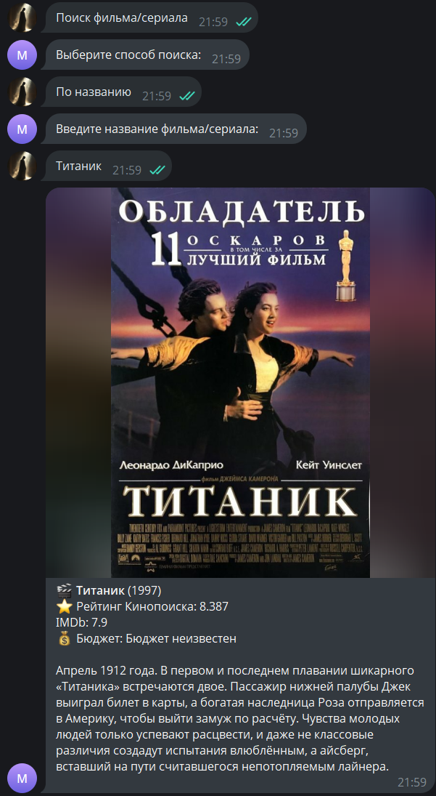

Telegram-бот для поиска фильмов // Movie Search Telegram Bot (@MyFirstExampleTgBot).

Этот Telegram-бот позволяет пользователям искать информацию о фильмах и сериалах, используя API.  
Бот предоставляет информацию о названии фильма, рейтинге, описании, бюджете и постер и т.д.

Пользовательский интерфейс представлен простым и удобным решением Reply-клавиатуры, 
который помогает найти нужную информацию пользователю в пару кликов, с сохранением всех ваших запросов в бд PeeWee

Инструкция по установке: 

1. Для корректной работы бота требуется установка следующих модулей:

- pyTelegramBotAPI
- requests
- python-dotenv
- os
- peewee

2. Создайте файл с названием .env в корне вашего репозитория (бота) со следующим содержанием:

BOT_TOKEN=токен_вашего_бота_полученного_от_BotFather
POISKINO_API_KEY=ваш_персональный_апи_ключ

* бот обращается к API PoiskKino, получить ваш ключ API можете написав их боту в TG: @poiskkinodev_bot

3. Бот запускается из файла main.py

4. /start -  Начало работы с ботом

