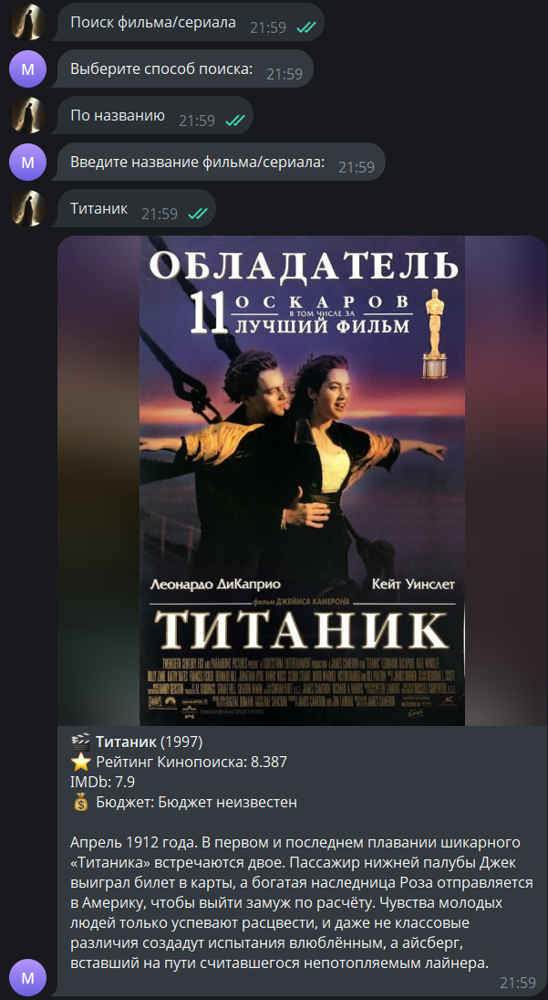

# Movie Telegram Bot (@MyFirstExampleTgBot)

Telegram bot for searching movies and TV series via **PoiskKino API**.

**Features:**
- Search by title, rating, description, budget, posters
- Convenient Reply-keyboard
- Search history in **Peewee** DB
- Inline search mode

## Quick launch

1. Clone repository
git clone https://github.com/arl-dev-py/movie_telegram_bot.git
cd movie_telegram_bot

2. Install dependencies
pip install -r requirements.txt

3. Create .env file
cp .env.example .env

Edit .env:
BOT_TOKEN=your_token_from_BotFather
POISKINO_API_KEY=key_from_@poiskkinodev_bot

4. Run bot
python main.py

Done! Find @MyFirstExampleTgBot in Telegram.

## Bot commands

/start  — Main menu + search history
Search — Movie/TV series title
Rating — Top movies
Popular — Trending

---

# Movie Telegram Bot (@MyFirstExampleTgBot)

Telegram-бот для поиска фильмов и сериалов через **PoiskKino API**. 

**Функции:**
- Поиск по названию, рейтингу, описанию, бюджету, постерам
- Удобная Reply-клавиатура 
- История запросов в **Peewee** БД
- Inline-режим поиска

## Быстрый запуск

1. Клонировать репозиторий
git clone https://github.com/arl-dev-py/movie_telegram_bot.git
cd movie_telegram_bot

2. Установить зависимости
pip install -r requirements.txt

3. Создать файл .env
cp .env.example .env

Отредактируйте .env:
BOT_TOKEN=ваш_токен_от_BotFather
POISKINO_API_KEY=ключ_от_@poiskkinodev_bot

4. Запустить бота
python main.py

Готово! Найдите @MyFirstExampleTgBot в Telegram.

## Команды бота

/start  — Главное меню + история поиска
Поиск — Название фильма/сериала
Рейтинг — Топ фильмы
Популярное — В тренде
